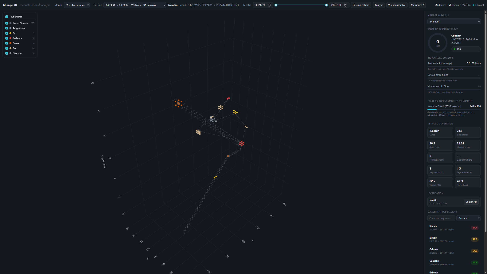
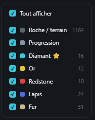
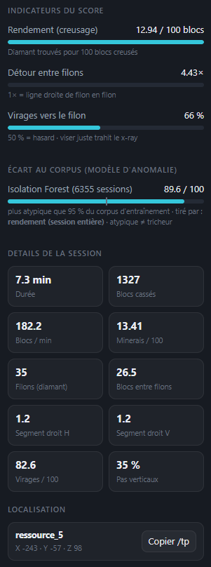
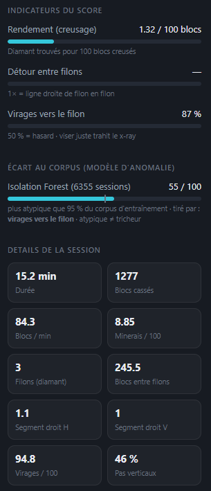
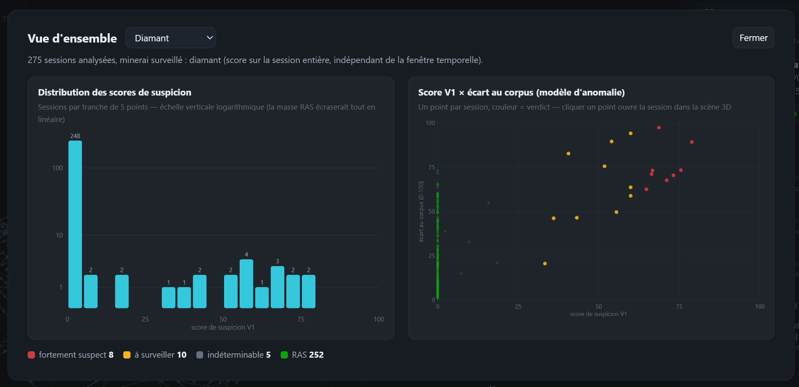

# AntiCheat X-Ray Detection

Outil d'analyse a posteriori des logs CoreProtect pour détecter un comportement de x-ray (minage guidé par une vision à travers les blocs) sur un serveur Minecraft. À partir de la base SQLite CoreProtect, le pipeline reconstruit les sessions de minage de chaque joueur, en extrait des indicateurs de trajectoire et de rendement, et calcule un score de suspicion 0-100 par session.

🔗 **[Démo live (anonymisée)](https://utruna.github.io/Coreprotect-mining-heuristics/)** — preview 3D interactive hébergée sur GitHub Pages, aucune installation nécessaire.

Deux façons de consulter les résultats :

- **Preview 3D interactive** — reconstruction de la scène de minage dans le navigateur, pour voir la différence entre un tunnel de strip-mining légitime et un chemin qui file de filon en filon. Voir [readmePreview.md](readmePreview.md).
- **Analyse statistique** — calcul des features par session et du score de suspicion, en ligne de commande ou intégré à la preview. Voir [readmeAnalyse.md](readmeAnalyse.md).

Un second regard complète le score : une forêt d'isolation (Isolation Forest) apprend la session de minage « typique » du serveur et signale les écarts. Son fonctionnement est expliqué pas à pas, schémas et graphiques à l'appui, dans [readmeArbre.md](readmeArbre.md).

Sur la base de test (vérité terrain connue), le score sépare nettement les deux joueurs x-ray simulés (67.2 et 59.7) du minage légitime (18.8) — détail dans [readmeAnalyse.md](readmeAnalyse.md#résultats-sur-la-base-test-vérité-terrain-connue).

## Aperçu de l'interface

### Vue d'ensemble du plugin


### Filtres et métriques
| Filtres | Métriques |
|---------|----------|
|  |  |

### Comparaison des comportements


### Vue ensemble graphique


## Démarrage rapide

1. Ouvrir le projet dans VS Code.
2. Vérifier que l'interpréteur utilisé est `.venv/Scripts/python.exe`.
3. Lancer la configuration du workspace :

```powershell
python -m xray_detector init
```

4. Afficher la configuration détectée :

```powershell
python -m xray_detector show-config
```

5. Générer la preview 3D et l'analyse :

```powershell
.venv\Scripts\python.exe scripts\render_mining_3d.py
```

Voir [readmePreview.md](readmePreview.md) et [readmeAnalyse.md](readmeAnalyse.md) pour toutes les options (base à analyser, fenêtre temporelle, minerai surveillé, anonymisation...).

## Structure

- `src/xray_detector/` : logique applicative (extraction, sessionization, features, pipeline, CLI)
- `scripts/` : preview 3D, analyse en ligne de commande, extraction des événements de minage
- `tests/` : tests unitaires
- `data/raw/` : archive et exports bruts (base CoreProtect SQLite)
- `data/interim/` : sorties temporaires
- `data/processed/` : tables prêtes pour l'analyse (CSV de features par session)
- `reports/figures/` : preview 3D, figures comparatives, captures
- `notebooks/` : exploration et EDA

## Prochaine étape

Voir « Limites connues et pistes » dans [readmeAnalyse.md](readmeAnalyse.md#limites-connues-et-pistes).
