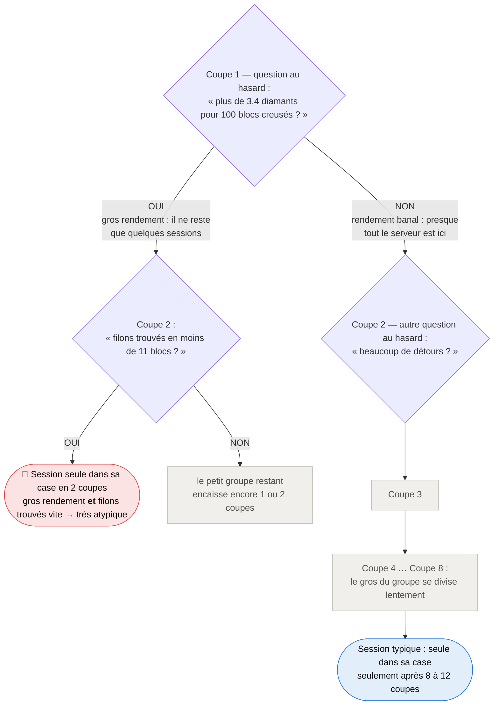
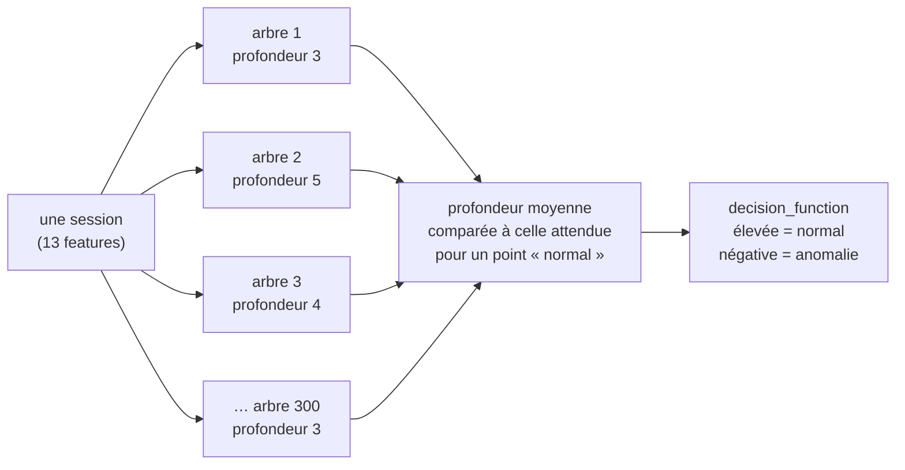
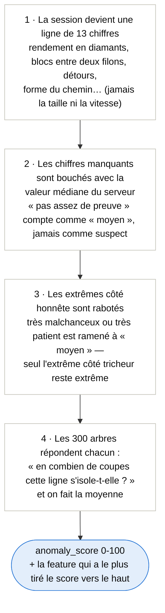

# La forêt d'isolation, expliquée

Cette page explique **comment fonctionne l'arbre d'isolation** (et la forêt de 300 arbres) qui produit la colonne `anomaly_score` — avec des schémas et des figures, sans prérequis en machine learning. Pour les choix de conception et les commandes d'entraînement, voir [readmeAnalyse.md](readmeAnalyse.md#détection-danomalies-non-supervisée-isolation-forest) ; le code est dans [anomaly_model.py](src/xray_detector/anomaly_model.py).

**L'idée en une phrase** : plutôt que de définir ce qu'est un tricheur (c'est le rôle du score V1), le modèle apprend à quoi ressemble une session de minage *typique* du serveur, et mesure à quel point une session s'en écarte.

## 1. Isoler un point avec des coupes aléatoires

Imaginez chaque session de minage comme un point dans un espace où chaque axe est une feature (rendement en diamants, facteur de détour, etc.). Le principe de l'arbre d'isolation tient en un geste : **couper l'espace au hasard, encore et encore, jusqu'à ce que chaque point se retrouve seul dans sa case**.

Un point au milieu du nuage (une session banale) a besoin de beaucoup de coupes avant d'être séparé de ses voisins. Un point isolé du nuage (une session atypique) tombe seul presque tout de suite :


C'est **le nombre de coupes nécessaires** (la « profondeur d'isolation ») qui fait le score : peu de coupes = atypique, beaucoup de coupes = normal. Aucune étiquette « tricheur / pas tricheur » n'intervient — c'est ce qui rend la méthode utilisable sans vérité terrain.

## 2. Un arbre d'isolation

Chaque série de coupes forme un **arbre** : chaque coupe est une question tirée au hasard (une feature, un seuil), et les sessions du serveur se répartissent selon leur réponse. On recoupe chaque groupe jusqu'à ce que chaque session soit seule. Le schéma suit deux sessions dans le même arbre — la suspecte est seule dès la 2ᵉ question, la typique reste noyée dans la masse :



À retenir : le score d'une session, c'est **le nombre de questions qu'il a fallu pour la retrouver seule**. Les questions étant aléatoires, aucune n'est intelligente en soi — c'est la répétition qui fait le tri.

Un seul arbre est très bruité (les coupes sont aléatoires !). C'est pour ça qu'on en construit **300** et qu'on moyenne :



Le hasard individuel de chaque arbre s'annule dans la moyenne ; ce qui reste, c'est le signal : *cette session est-elle structurellement facile à isoler du corpus ?* Autre avantage : comme chaque coupe porte sur **une seule feature à la fois**, on peut mélanger des blocs, des ratios et des taux sans se soucier de leurs échelles.

## 3. Le trajet d'une session dans le modèle

Concrètement, que se passe-t-il entre « une session de minage » et « un score » ? Quatre étapes, dans l'ordre :



Deux précisions sur ces étapes :

- **Étape 2 (trous bouchés à la médiane)** : un indicateur vaut NaN quand la session n'a pas assez de matière pour le calculer (par ex. rendement sur moins de 30 blocs creusés). En le remplaçant par la médiane — la valeur « la plus moyenne » du serveur — une session incomplète ne peut pas devenir suspecte *à cause de ses trous*.
- **La feature explicative** (`anomaly_top_feature`) : pour savoir *pourquoi* une session score haut, on la rejoue 13 fois en remplaçant à chaque fois une feature par la médiane ; celle dont le remplacement fait le plus rechuter le score est la coupable.

## 4. L'écrêtage directionnel — la leçon de la vérité terrain

Un arbre d'isolation est **non-directionnel** : il isole ce qui est extrême, peu importe le sens. Première leçon de la base de test : la longue session patiente du joueur légitime (200 blocs creusés entre deux filons, un record de malchance) ressortait *plus atypique qu'un tricheur*.

La correction : pour les 6 features de rendement / intentionnalité dont la direction suspecte est connue (`SUSPICIOUS_DIRECTION`), tout ce qui dépasse la médiane **du côté légitime** est ramené à la médiane. Être très malchanceux ou très quadrilleur ne rend plus « anormal » ; trouver les filons anormalement vite, si :


Les 7 features de pure forme (longueurs de segments, ratios de pas…), sans direction évidente, restent bilatérales. Ne pas retirer cet écrêtage sans revalider la vérité terrain : sans lui, le modèle classe un mineur patient au-dessus d'un x-rayeur.

## 5. Du score brut au score 0-100

La forêt sort une `decision_function` (élevée = normal, négative = anomalie au sens du seuil de contamination). Pour la rendre lisible, on la replie sur une échelle 0-100 par deux segments de droite, ancrés sur les extrêmes du corpus d'entraînement — **50 tombe exactement sur le seuil de contamination** :


Un score ≥ 50 se lit donc « plus atypique que 95 % du corpus » (contamination = 0,05), **pas** « probabilité de triche ».

## 6. Ce que ça donne sur les données

Sur le corpus réel (413 sessions), l'essentiel des sessions se masse sous 30 et ~5 % passent la barre des 50 — par construction. Sur la vérité terrain (base de test, jamais vue à l'entraînement), le classement est le bon : les deux x-rayeurs simulés passent devant le mineur légitime, avec une marge plus mince que le score V1 sur le cas serré (49,5 vs 42,0) :


## 7. Comment lire ce score (et comment ne pas le lire)

- **Atypique ≠ tricheur.** Le modèle dit « cette session ne ressemble pas au corpus », rien de plus. Une technique de minage rare mais honnête score haut.
- Le score se lit **à côté du score V1**, jamais seul : c'est la confrontation des deux qui est informative (corrélation de rang 0,43 — assez proches pour se conforter, assez différents pour se compléter).
- Une session signalée par les deux, ou atypique par une feature de forme que le V1 n'exploite pas, est exactement le genre de session à aller regarder dans la [preview 3D](readmePreview.md).

## Reproduire les figures

```powershell
.venv\Scripts\python.exe scripts\make_anomaly_figures.py
```

Le script ([make_anomaly_figures.py](scripts/make_anomaly_figures.py)) recharge le modèle committé (`data/models/anomaly_iforest_diamond.joblib`) et le corpus anonymisé, et régénère les quatre PNG dans `reports/figures/`.
